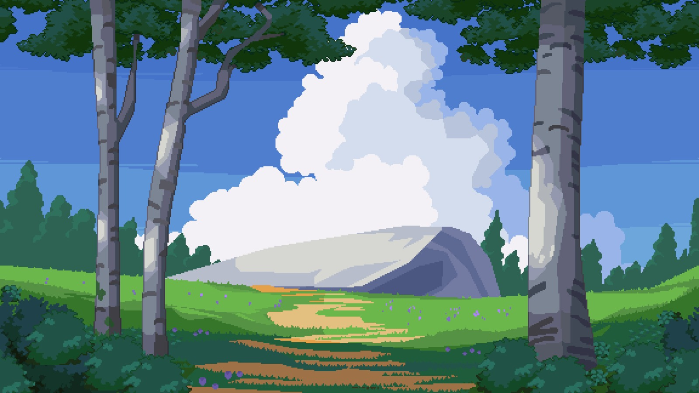

# 🏰 Torre del Mago: Rescata a la Princesa

Un juego de plataformas de acción 2D donde juegas como un mago hábil en una misión para rescatar a una princesa de una torre malvada. ¡Navega a través de 4 niveles desafiantes, recolecta gemas, mejora tus habilidades y domina el arte de la magia de bolas de fuego!



## 🎮 Características del Juego

- **4 Niveles Únicos** con temas y desafíos distintivos
- **Generación Procedural de Niveles** para mayor rejugabilidad
- **Sistema de Combate** con magia de bolas de fuego y mecánicas de tiempo de espera
- **Sistema de Tienda** con mejoras significativas (salud, velocidad de bola de fuego)
- **Sistema de Audio Completo** con música de niveles y efectos de sonido
- **Integración con Base de Datos MySQL** con autenticación de usuarios y estadísticas
- **Animación de Sprites Profesional** con estética de arte pixelado
- **Sistema de Recolección de Corazones** para restauración de salud
- **Recolección de Gemas** para moneda de la tienda
- **IA Avanzada de Enemigos** (enemigos básicos, minotauros, generadores de barriles)

## 🚀 Inicio Rápido

### Requisitos Previos

Asegúrate de tener lo siguiente instalado en tu computadora:

- **Node.js** (versión 14 o superior) - [Descargar aquí](https://nodejs.org/)
- **MySQL** (versión 8.0 o superior) - [Descargar aquí](https://dev.mysql.com/downloads/)
- **Git** - [Descargar aquí](https://git-scm.com/)
- **Navegador Web** (Chrome, Firefox, Safari, o Edge)

### Instalación

1. **Clonar el repositorio:**
   ```bash
   git clone https://github.com/PaoloZesatiTec/Equipo-1.git
   cd Equipo-1
   ```

2. **Instalar dependencias:**
   ```bash
   npm install
   ```

3. **Configurar Base de Datos MySQL:**
   
   **Opción A: Usar script SQL proporcionado**
   ```bash
   # Iniciar servicio MySQL
   mysql -u root -p
   
   # Crear base de datos y tablas (ejecutar los comandos SQL de tu configuración de base de datos)
   CREATE DATABASE mage_tower;
   USE mage_tower;
   
   # Crear tablas de usuario según sea necesario para autenticación
   ```

   **Opción B: El juego creará las tablas automáticamente cuando te registres por primera vez**

4. **Configurar Conexión a Base de Datos:**
   - Actualizar credenciales de base de datos en `app.js` y `Servidor/app.js` si es necesario
   - La conexión predeterminada asume MySQL ejecutándose en localhost:3000

5. **Iniciar el Servidor del Juego:**
   ```bash
   node app.js
   ```

6. **Abrir tu Navegador:**
   - Navegar a `http://localhost:3000`
   - Deberías ver la pantalla de inicio de sesión/registro

## 🎯 Cómo Jugar

### Empezando

1. **Crear Cuenta**: Registrarse con nombre de usuario y contraseña
2. **Iniciar Sesión**: Usar tus credenciales para acceder al juego
3. **Iniciar Juego**: Hacer clic en "Iniciar Juego" desde el menú principal

### Controles

| Tecla | Acción |
|-------|--------|
| `A` / `D` | Moverse izquierda/derecha |
| `W` / `S` | Subir/bajar escaleras |
| `Espacio` | Saltar |
| `E` | Lanzar Bola de Fuego |
| `P` | Pausar juego |
| `Q` | Salir al menú (cuando está pausado) |

### Controles de la Tienda
| Tecla | Acción |
|-------|--------|
| `W` / `S` | Navegar artículos de la tienda |
| `Espacio` | Comprar/Continuar |

### Mecánicas de Juego

#### Sistema de Combate
- **Magia de Bola de Fuego**: Tu ataque principal con un temporizador de tiempo de espera
- **Tiempo de Espera**: 10 segundos (reducible a 7 segundos con mejoras)
- **Objetivos**: Enemigos, barriles y objetos destructibles

#### Sistema de Salud
- **Vidas Iniciales**: 2 vidas
- **Vidas Máximas**: 5 vidas (con mejoras)
- **Invulnerabilidad**: Período de gracia de 2 segundos después de recibir daño
- **Recolección de Corazones**: Restaurar 1 vida (solo cuando falte salud)

#### Moneda y Mejoras
- **Gemas**: Recolectar gemas a lo largo de los niveles para moneda de la tienda
- **Acceso a la Tienda**: Disponible después de morir antes de reaparecer
- **Tipos de Mejoras**:
  - **Mejora de Vida Nivel 1**: Aumentar vidas máximas a 3 (Costo: gemas)
  - **Mejora de Vida Nivel 2**: Aumentar vidas máximas a 4 (Costo: gemas) 
  - **Mejora de Vida Nivel 3**: Aumentar vidas máximas a 5 (Costo: gemas)
  - **Bola de Fuego Rápida**: Reducir tiempo de espera de 10s a 7s (Costo: gemas)
  - **Continuar**: Regresar al Nivel 1 con mejoras actuales

### Progresión de Niveles

#### Nivel 1: Reino del Bosque 🌲
- **Tema**: Ambiente de bosque natural
- **Enemigos**: Enemigos básicos y generación moderada de barriles
- **Enfoque**: Aprender mecánicas básicas y movimiento

#### Nivel 2: Reino del Cielo ☁️
- **Tema**: Ambiente de cielo lleno de nubes
- **Enemigos**: Dificultad aumentada con más minotauros
- **Enfoque**: Dominio del combate y gestión de enemigos

#### Nivel 3: Reino Volcánico 🌋
- **Tema**: Ambiente volcánico oscuro
- **Enemigos**: Alta densidad de enemigos con patrones desafiantes
- **Enfoque**: Plataformeo avanzado y cronometraje

#### Nivel 4: Torre Final 🏰
- **Tema**: Torre del mago malvado con estética de lava fundida
- **Peligro Especial**: ¡Lava que sube (muerte instantánea!)
- **Objetivo**: Alcanzar a la princesa para completar el juego

### Tipos de Enemigos

- **Enemigos Básicos**: Enemigos simples terrestres - evitar o derrotar con bolas de fuego
- **Minotauros**: Enemigos más fuertes
- **Generadores de Barriles**: Generan proyectiles de barriles rodantes periódicamente
- **Barriles Rodantes**: Peligros proyectiles que caen desde arriba - ¡salta sobre ellos!

### Consejos para el Éxito

1. **Recolectar Todo**: Las gemas son esenciales para las mejoras
2. **Gestionar Tiempos de Espera**: Cronometrar el uso de bolas de fuego estratégicamente
3. **Usar Escaleras**: El movimiento vertical es clave para evitar enemigos
4. **Guardar Corazones**: Solo recoger corazones cuando falten vidas
5. **Mejorar Sabiamente**: Las mejoras de vida proporcionan el mayor valor de supervivencia
6. **Aprender Patrones**: Los movimientos de los enemigos son predecibles - usar esto a tu favor
7. **Pausar Cuando Sea Necesario**: Usar P para pausar y planear tu próximo movimiento

### Experiencia de Audio

El juego cuenta con un sistema de audio completo:
- **Música de Niveles**: Temas únicos para cada nivel que se repiten sin problemas
- **Efectos de Sonido**: Sonidos de salto, lanzamiento de bolas de fuego, daño recibido, y más
- **Audio Dinámico**: La música cambia entre niveles y visitas a la tienda
- **Control de Volumen**: Niveles de audio optimizados para el juego

## 🛠️ Solución de Problemas

### Problemas Comunes

**El juego no inicia:**
- Asegurar que Node.js esté instalado: `node --version`
- Verificar si el puerto 3000 está disponible: `lsof -ti:3000`
- Matar cualquier proceso en el puerto 3000: `lsof -ti:3000 | xargs kill -9`

**Errores de conexión a base de datos:**
- Verificar que MySQL esté ejecutándose: `mysql -u root -p`
- Revisar credenciales de base de datos en archivos de configuración
- Asegurar que la base de datos exista y sea accesible

**Audio no se reproduce:**
- Hacer clic en cualquier lugar de la página para habilitar audio (requerimiento del navegador)
- Verificar configuraciones de audio del navegador
- Asegurar que los archivos de audio estén presentes en `game/assets/Music/`

**Problemas de rendimiento:**
- Cerrar otras pestañas del navegador para liberar memoria
- Probar un navegador diferente (Chrome recomendado)
- Verificar recursos del sistema

### Comandos de Terminal

```bash
# Iniciar el juego
node app.js

# Matar procesos en el puerto 3000
lsof -ti:3000 | xargs kill -9

# Verificar versión de Node.js
node --version

# Verificar conexión MySQL
mysql -u root -p
```

## 🏗️ Arquitectura Técnica

### Stack Tecnológico
- **Frontend**: HTML5 Canvas, JavaScript ES6+
- **Backend**: Node.js con Express
- **Base de Datos**: MySQL 8.0+
- **Audio**: Web Audio API con soporte MP3
- **Gráficos**: Canvas 2D con sistema de animación de sprites

### Estructura del Proyecto
```
Equipo-1/
├── game/
│   ├── assets/          # Sprites, audio, fondos
│   ├── html/           # Archivos HTML del juego
│   └── js/             # Lógica del juego y sistemas
├── Servidor/           # Configuración del servidor
├── GDD/               # Documento de Diseño del Juego
└── app.js             # Archivo principal del servidor
```

## 🎵 Créditos de Audio

El juego cuenta con música original y efectos de sonido:
- Música de fondo de niveles (4 pistas únicas)
- Música de la tienda
- Efectos de sonido (salto, bola de fuego, daño, etc.)
- Sistema de cambio de audio dinámico

## 🚦 Estado del Juego

**Versión Actual**: Funcionalidad Completa ✅
- ✅ 4 niveles completos con temas únicos
- ✅ Sistemas completos de combate y mejoras
- ✅ Sistema de audio completo
- ✅ Integración de base de datos con cuentas de usuario
- ✅ Animaciones de sprites profesionales
- ✅ Física robusta y detección de colisiones

## 👥 Equipo de Desarrollo

- **Paolo Zesati** - Desarrollador
- **Efren Chavez** - Desarrollador
- **Juan Pablo Narchi** - Desarrollador

## 📄 Licencia

Este proyecto está desarrollado con fines educativos.

---

**¿Listo para rescatar a la princesa? ¡Comienza tu aventura ahora!** 🏰✨

Para soporte técnico o preguntas, por favor consulta la sección de solución de problemas o revisa el Documento de Diseño del Juego en la carpeta `GDD/`.
