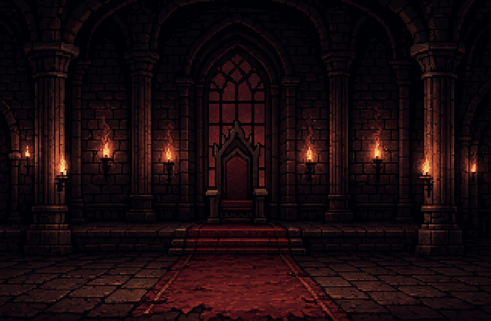

# **Nombre del Juego**

## _Documento de Diseño del Juego_

---

##### **Aviso de derechos de autor / información del autor / cosas legales aburridas que a nadie le gustan_

Paolo Zesati
Efren
Juan Pablo Narchi

##
## _Índice_

---

1. [Índice](#índice)
2. [Diseño del Juego](#diseño-del-juego)
    1. [Resumen](#resumen)
    2. [Jugabilidad](#jugabilidad)
    3. [Mentalidad](#mentalidad)
3. [Técnico](#técnico)
    1. [Pantallas](#pantallas)
    2. [Controles](#controles)
    3. [Mecánicas](#mecánicas)
4. [Diseño de Niveles](#diseño-de-niveles)
    1. [Temas](#temas)
    2. [Flujo del Juego](#flujo-del-juego)
5. [Desarrollo](#desarrollo)
    1. [Clases Abstractas](#clases-abstractas--componentes)
    2. [Clases Derivadas](#clases-derivadas--composiciones-de-componentes)
6. [Gráficos](#gráficos)
    1. [Atributos de Estilo](#atributos-de-estilo)
    2. [Gráficos Necesarios](#gráficos-necesarios)
7. [Sonidos/Música](#sonidosmúsica)
    1. [Atributos de Estilo](#atributos-de-estilo-1)
    2. [Sonidos Necesarios](#sonidos-necesarios)
    3. [Música Necesaria](#música-necesaria)
8. [Calendario](#calendario)

# _Diseño del Juego_

---

## **Resumen**

Este es un juego de plataformas arcade 2D tipo roguelike inspirado en el original *Donkey Kong*. El jugador controla a un personaje común que debe escalar plataformas para rescatar a una princesa del malvado Mago Oscuro. El juego cuenta con tres niveles, cada uno con enemigos y obstáculos únicos, culminando en una batalla final contra el jefe.

Cada partida otorga al jugador experiencia basada en su progreso, que puede gastarse en el menú principal para mejorar **vidas (de 2 a 3)** o **velocidad de movimiento**. Los jugadores deben saltar sobre barriles rodantes, derrotar enemigos usando una bola de fuego (con tiempo de espera), y escalar escaleras para perseguir al mago a través de los niveles.

---

## **Jugabilidad**

- **Objetivo:** Escalar cada nivel para alcanzar al Mago Oscuro mientras esquivas barriles y derrotas enemigos. Alcanza al mago tres veces para entrar a la sala del jefe final y derrotarlo con 3 golpes de bola de fuego.
- **Jugador:** El jugador tendrá la habilidad de bola de fuego, necesita saltar sobre los barriles y evitar o derrotar enemigos. La partida del jugador terminará cuando reciba un golpe.
- **Mecánica de Bola de Fuego:** El jugador puede lanzar una bola de fuego cada 10 segundos, la bola rebotará y destruirá barriles o derrotará enemigos, pero no podrá destruir hechizos.
- **Descripción de niveles:**
  - **Nivel 1:** Este primer nivel no tendrá enemigos, este nivel es para que el jugador entienda las mecánicas mientras solo tiene que evitar los barriles.
  - **Nivel 2:** El segundo nivel tendrá la velocidad de los barriles aumentada, añadiendo un enemigo: Los lobos, su movimiento será entre dos barriles, forzando al jugador en este nivel a gestionar su bola de fuego, y evitar o matar a los lobos.
  - **Nivel 3:** El tercer nivel será el último antes de la cámara del jefe final, en este tendrás magos de bajo nivel, que lanzan hechizos que matan al contacto, los hechizos se moverán entre cada barril arriba, los magos estarán al final de la línea, así que no podrás matarlos hasta que llegues a ellos, así que el desafío en este nivel es cronometrar tus saltos para poder saltar entre dos barriles y evitar el hechizo.
  - **Cámara del Jefe Final:** Este es el último desafío antes de completar el juego, derrotar al jefe final, un mago de alto nivel que tendrá 3 ataques diferentes, que no se pueden destruir:
      - **Ataque 1:** El primero lanzará hechizos grandes, que caerán del techo, dejando solo un espacio para que el jugador pase entre ellos.
      - **Ataque 2:** El segundo ataque, estará inspirado en las usuales batallas contra Bowser, donde el mago lanzará hechizos, que girarán alrededor del mago, y irán en orden ascendente.
      - **Ataque 3:** El tercer ataque será un aturdimiento del mago, que inmovilizará al jugador por 2 segundos.
  - La forma de derrotar al jefe final será golpeándolo con la bola de fuego 3 veces.
- **Obstáculos:** Barriles rodantes invocados por el Mago Oscuro.
- **Herramientas:** Escaleras para ascender, bolas de fuego para atacar, salto para evitar barriles.
- **Mejoras de Poder:** Las mejoras de poder se dividirán en dos: en juego (Solo estarán activas por un tiempo en la partida, o solo para esa partida) y permanentes (la mejora será permanente, disponible para todas las partidas después de obtenerla).
  - **En juego:**
      - **Ralentización del tiempo:** Una mejora que puedes encontrar en el nivel, que hará que la velocidad de los barriles y enemigos sea más lenta, dándote más oportunidad para maniobrar y evitar obstáculos o enemigos.
      - **Reinicio de enfriamiento de fuego:** El tiempo de cuenta regresiva para la próxima bola de fuego será cero.
  - **Permanentes:**
      - **Vida extra:** La mejora que se puede desbloquear que te hará resistir un golpe más antes de morir, el límite de esta mejora será tener dos vidas extra.
      - **Poder de fuego mejorado:** Esta mejora reducirá el tiempo de enfriamiento en 0.5 segundos antes de que el usuario pueda lanzar otra bola de fuego, el límite de esta mejora es que el enfriamiento llegue a 5s para mantener cierta dificultad.

- 
Si el jugador muere, regresa al **Menú Principal**. Se pierde el progreso, pero se mantiene la experiencia para las mejoras.

---

## **Mentalidad**

Los jugadores deberían sentir:
- **Desafiados** — los reinicios tipo roguelike aumentan la tensión y recompensan la precisión.
- **Determinados** — alcanzar al mago significa progreso.
- **Empoderados** — las mejoras permiten a los jugadores mejorar e intentar de nuevo.

Provocamos esto a través de la creciente dificultad de los niveles, obstáculos basados en tiempo, y recompensando el progreso con mejoras permanentes de estadísticas.

---

## _Técnico_

---

### **Pantallas**

1. **Menú Principal**
   - Mejorar Vidas
   - Mejorar Velocidad
   - Iniciar Juego
2. **Pantallas de Nivel (1–3)**
3. **Sala del Jefe Final**
4. **Game Over / Reintentar**
5. **Créditos Finales**

---

### **Controles**

- `a` / `d` — Moverse
- `w` / `s` — Subir/Bajar escalera
- `Espacio` — Saltar
- `F` — Lanzar Bola de Fuego (10s de enfriamiento)
- `Enter` — Confirmar / Interactuar

---

### **Mecánicas**

- **Sistema de Bola de Fuego:** Temporizador simple de enfriamiento usando reloj interno.
- **Generador de Barriles:** Los barriles se generarán en la parte superior del nivel y caerán.
- **Comportamiento de Enemigos:** El comportamiento del enemigo será como se describe en cada nivel.
- **Reinicio Tipo Roguelike:** Se activa al morir, reinicia todo el progreso excepto la EXP.
- **Sistema de EXP:** Rastrea el progreso y permite mejoras entre partidas.

---

## _Diseño de Niveles_

---

### **Temas**

- **Nivel 1: Bosque**
  - Ambiente: Áspero, tenso
  - Objetivos: hacer que el jugador entienda las mecánicas de la bola de fuego y el salto.
  - Obstáculos: Barriles y escaleras
- **Nivel 2: Lobos y Orcos en Palacio Embrujado**
  - Ambiente: Áspero, tenso
  - Objetivos: Introducir al jugador al lobo, el primero de dos enemigos
  - Obstáculos: Lobos, barriles y escaleras
- **Nivel 3: Torres de Mago en un Volcán**
  - Ambiente: Mágico, caótico
  - Objetivos: Enseñar al jugador a no apresurarse en el nivel, ya que los saltos entre barriles serán más difíciles
  - Obstáculos: Mago, barriles y escaleras escalonadas

### **Flujo del Juego**

1. Menú principal: Gastar EXP, iniciar partida
2. Nivel 1: Esquivar barriles, escalar escaleras, derrotar orcos
3. Alcanzar al Mago → Se teletransporta
4. Nivel 2: Repetir con lobos, barriles más rápidos
5. Nivel 3: Magos, verticalidad añadida
6. Sala Final: Batalla contra el mago — golpear con bola de fuego 3 veces
7. Victoria → Princesa rescatada → Pantalla final

---

## _Desarrollo_

---

### **Clases Abstractas / Componentes**

- `EntidadBase`
  - `Jugador`
  - `Enemigo`
  - `Proyectil`
- `EnemigoBase`
  - `Orco`
  - `Lobo`
  - `Mago`
- `ObjetoBase`
  - `Barril`
  - `Escalera`
  - `MejoraDePoder`
- `EstadoJuegoBase`
  - `MenúPrincipal`
  - `Nivel`
  - `GameOver`
  - `JefeFinal`

### **Clases Derivadas / Comportamientos**

- `ProyectilBolaFuego` — 10s de enfriamiento
- `SistemaEXP` — Rastrea la distancia recorrida y otorga XP
- `GeneradorBarriles` — El mago envía barriles periódicamente
- `ComportamientoEnemigo`
  - `IAOrco`: Caminar izquierda/derecha
  - `IALobo`: Caminar izquierda/derecha muy rápido
  - `IAMago`: Lanza hechizos

---

## _Gráficos_

---

### **Atributos de Estilo**

- Arte pixelado con estética retro
- Paleta de colores limitada para cada nivel
- Contornos gruesos con contrastes audaces
- Retroalimentación visual:
  - Destello al recibir daño
  - Brillo en objetos interactuables
  - Círculo de enfriamiento para bola de fuego

---

### **Gráficos Necesarios**

- **Jugador**
  - Inactivo, Caminar, Saltar, Lanzar
- **Enemigos**
  - Orco, Lobo, Mago (Inactivo, Caminar, Atacar)
- **Jefe Mago**
  - Inactivo, Lanzar, Teletransportar, Derrota
- **Objetos**
  - Barril (rodando)
  - Escalera (estática)
  - Bola de fuego (animada)
  - Mejoras de poder (orbe brillante)
- **Interfaz**
  - Barra de XP, indicador de enfriamiento de bola de fuego, salud

### **Sprites Disponibles**

Aquí están los sprites actualmente disponibles para el juego:

# Sprites del Juego

## Fondos de Niveles

### Fondo del Nivel 1 (Bosque)

### Fondo del Nivel 2 (Palacio Embrujado)

### Fondo del Nivel 3 (Torre del Mago)

### Fondo del Jefe Final

## Personajes Jugables

### Personaje Principal - Estilo 1

### Personaje Principal - Estilo 2

### Personaje Principal - Estilo 3

## Enemigos y Obstáculos

### Barriles (Obstáculos)

### Villanos de Niveles 1-3

### Jefe Final

---

## _Sonidos/Música_

---

### **Atributos de Estilo**

- Música tipo chiptune
  - En bucle, ritmo rápido durante los niveles
  - Tema oscuro y tenso para el jefe
  - Optimista para el menú principal y la victoria
- Efectos de Sonido
  - Salto (estilo retro boing)
  - Lanzamiento de bola de fuego (woosh/pop)
  - Barril rodando (retumbar)
  - Golpe a enemigo (sonido de impacto)
  - Recoger mejora (campana)

---

### **Sonidos Necesarios**

- Salto
- Lanzamiento de Bola de Fuego
- Golpe a Enemigo
- Teletransporte del Mago
- Recoger Regeneración de Salud
- Navegación del Menú

---

### **Música Necesaria**

1. Tema del Menú Principal (retro, esperanzador)
2. Tema del Nivel 1 (bosque tenso)
3. Tema del Nivel 2 (tempo más rápido)
4. Tema del Nivel 3 (caótico/mágico)
5. Tema del Jefe Final
6. Tema de Victoria

---

## _Calendario_

---

1. **Semana 1–2:** 
   - Mecánicas base: movimiento, salto, escaleras, bola de fuego
2. **Semana 3:**
   - Generación de barriles, sistema de enfriamiento, reinicio tipo roguelike
3. **Semana 4:**
   - IA de enemigos (Orco/Lobo/Mago), cambio de niveles
4. **Semana 5:**
   - Lógica de batalla contra jefe, salud, daño
5. **Semana 6:**
   - Menú principal, sistema de EXP, mejoras
6. **Semana 7:**
   - Gráficos, animaciones, integración de sonido
7. **Semana 8:**
   - Pulido, corrección de errores, balance

_(ejemplo)_
