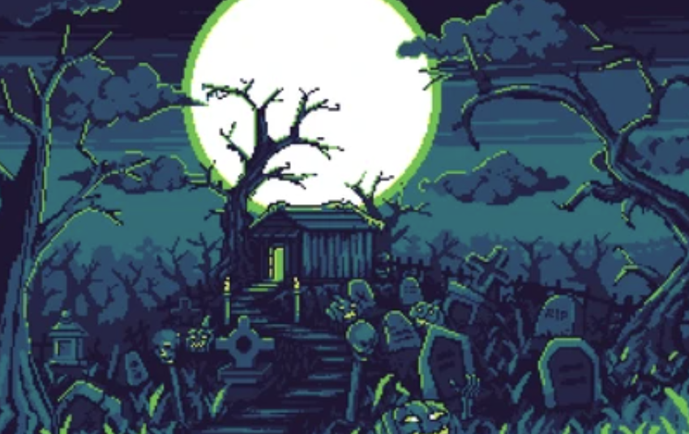

# **Game Name Here**

## _Game Design Document_

---

##### **Copyright notice / author information / boring legal stuff nobody likes**

Paolo Zesati
Efren
Juan Pablo Narchi

##
## _Index_

---

1. [Index](#index)
2. [Game Design](#game-design)
    1. [Summary](#summary)
    2. [Gameplay](#gameplay)
    3. [Mindset](#mindset)
3. [Technical](#technical)
    1. [Screens](#screens)
    2. [Controls](#controls)
    3. [Mechanics](#mechanics)
4. [Level Design](#level-design)
    1. [Themes](#themes)
    2. [Game Flow](#game-flow)
5. [Development](#development)
    1. [Abstract Classes](#abstract-classes--components)
    2. [Derived Classes](#derived-classes--component-compositions)
6. [Graphics](#graphics)
    1. [Style Attributes](#style-attributes)
    2. [Graphics Needed](#graphics-needed)
7. [Sounds/Music](#soundsmusic)
    1. [Style Attributes](#style-attributes-1)
    2. [Sounds Needed](#sounds-needed)
    3. [Music Needed](#music-needed)
8. [Schedule](#schedule)

# _Game Design_

---

## **Summary**

This is a rogue-like 2D arcade platformer inspired by the original *Donkey Kong*. The player controls a regular guy climbing platforms to rescue a princess from the evil Dark Mage. The game features three levels, each with unique enemies and obstacles, culminating in a final boss fight.

Each run earns the player experience based on progress, which can be spent in the main menu to upgrade **lives (from 2 to 3)** or **movement speed**. Players must jump over rolling barrels, defeat enemies using a fireball (with a cooldown), and climb ladders to chase the mage across levels.

---

## **Gameplay**

- **Objective:** Climb each level to reach the Dark Mage while dodging barrels and defeating enemies. Reach the mage three times to enter the final boss room and defeat him with 3 fireball hits.
- **Player:** The player will have the fireball ability, he needs to jump over the barrells and avoiding or defeating enemies. The player's run will end when he gets hit once.
- **Fireball Mechanic:** The player can cast a fireball every 10 seconds, the fireball will bounce and will destroy barrells or defeat enemies, but it can´t destroy spells.
- **Level description:**
  - **Level 1:** This first level wont have enemies, this level is for the player to understand the mechanics while only having to avoid the barrels.
  - **Level 2:** The second level will have the barrel speed increased, adding an enemy: The wolves, their movement is going to be between two barrels, forcing the player on this level to manage their fireball, and avoiding the wolves or killing them.
  - **Level 3:** The third level will be the last before the final boss chamber, in this one you will have low level mages, who cast spells, that kill on contact, the spells will be moving between each barrel above, the mages will be at the end of the line, so you cant kill them only until you reach to them, so the challenge on this level is to time your jumps so you can jump between two barrells and avoiding the spell.
  - **Final Boss Chamber:** This is the last challenge before to completing the game, defeating the final boss, a high-level mage who will have 3 different atacks, that can't be destroyed:
      - **Attack 1:** The first one will cast big spells, which will fall from the ceilling, just giving a gap to the player to pass between them.
      - **Attack 2:** The second atack, will be inspired by usual Bowser boss fights, where the mage will cast spells, that will go around the mage, and will go in ascending order.
      - **Attack 3:** The third attack will a stun from the mage, that will inmobilize the player for 2 seconds.
  - The way to deffeat the final boss will be by getting hit by the fireball 3 times.
- **Obstacles:** Rolling barrels summoned by the Dark Mage.
- **Tools:** Ladders to ascend, fireballs to attack, jump to avoid barrels.
- **Power-Ups:** The power ups will divide in two: in game (They will be only active for a time in the run, or only for that run) and permanent (the power-up will be permanent, available for all the runs after obtaining it).
  - **In game:**
      - **Time slow:** A power up that you can find in the level, that will make the speed of the barrels and enemies slower, giving you more opportunity to manouver and avoid obstacles or enemies.
      - **Fire cooldown reset:** The countdown time of the next fireball will be zero.
  - **Permanent:**
      - **Extra life:** The power up that can be unlocked that will make you resist one more hit before dying, the limit of this power up will be having two extra lifes.
      - **Upgraded firepower:** This power up will lower the cooldown time by .5 seconds before the user can throw another fireball, the limit of this power up is the cooldown getting to 5s to mantain certain difficulty.

- 
If the player dies, they are returned to the **Main Menu**. Progress is lost, but experience is kept for upgrades.

---

## **Mindset**

Players should feel:
- **Challenged** — rogue-like resets raise tension and reward precision.
- **Determined** — reaching the mage means progress.
- **Empowered** — upgrades let players improve and try again.

We provoke this through increasing level difficulty, timing-based obstacles, and rewarding progress with permanent stat upgrades.

---

## _Technical_

---

### **Screens**

1. **Main Menu**
   - Upgrade Lives
   - Upgrade Speed
   - Start Game
2. **Level Screens (1–3)**
3. **Final Boss Room**
4. **Game Over / Retry**
5. **End Credits**

---

### **Controls**

- `a` / `d` — Move
- `w` / `s` — Climb ladder
- `Space` — Jump
- `F` — Cast Fireball (10s cooldown)
- `Enter` — Confirm / Interact

---

### **Mechanics**

- **Fireball System:** Simple cooldown timer using internal clock.
- **Barrel Spawner:** The barrels will spawn at the top of the level and will fall.
- **Enemy Behavior:** The behavior of the enemy will be as .
- **Rogue-like Reset:** Triggers on death, resets all progress except EXP.
- **EXP System:** Tracks progress and enables upgrades between runs.

---

## _Level Design_

---

### **Themes**

- **Level 1: Forest**
  - Mood: Gritty, tense
  - Objectives: making the player understand the mechanics of the fireball and jump.
  - Obstacles: Barrels and ladders
- **Level 2: Wolves and Orcs in Haunted Palace **
  - Mood: Gritty, tense
  - Objectives: Introducing the player to the wolf, the first of two enemies
  - Obstacles: Wolves, barrels and the ladders
- **Level 3: Mage Towers in a Volcano**
  - Mood: Magical, chaotic
  - Objectives: Teaching the player to not rush the level, as the jumps between barrells will be more difficult
  - Obstacles: Mage, barrels and staggered ladders

### **Game Flow**

1. Main menu: Spend EXP, start run
2. Level 1: Dodge barrels, climb ladders, defeat orcs
3. Reach Mage → Teleports away
4. Level 2: Repeat with wolves, faster barrels
5. Level 3: Mages, added verticality
6. Final Room: Mage fight — hit with fireball 3 times
7. Victory → Princess rescued → End screen

---

## _Development_

---

### **Abstract Classes / Components**

- `BaseEntity`
  - `Player`
  - `Enemy`
  - `Projectile`
- `BaseEnemy`
  - `Orc`
  - `Wolf`
  - `Mage`
- `BaseObject`
  - `Barrel`
  - `Ladder`
  - `PowerUp`
- `BaseGameState`
  - `MainMenu`
  - `Level`
  - `GameOver`
  - `FinalBoss`

### **Derived Classes / Behaviors**

- `FireballProjectile` — 10s cooldown
- `EXPSystem` — Tracks run distance and awards XP
- `BarrelSpawner` — Mage sends barrels periodically
- `EnemyBehavior`
  - `OrcAI`: Walk left/right
  - `WolfAI`: Walk left/right very quick
  - `MageAI`: Casts spells

---

## _Graphics_

---

### **Style Attributes**

- Pixel art with retro aesthetics
- Limited color palette for each level
- Heavy outlines with bold contrasts
- Visual feedback:
  - Flash on damage
  - Glow on interactables
  - Cooldown circle for fireball

---

### **Graphics Needed**

- **Player**
  - Idle, Walk, Jump, Cast
- **Enemies**
  - Orc, Wolf, Mage (Idle, Walk, Attack)
- **Mage Boss**
  - Idle, Cast, Teleport, Defeat
- **Objects**
  - Barrel (rolling)
  - Ladder (static)
  - Fireball (animated)
  - Power-ups (glowing orb)
- **UI**
  - XP bar, fireball cooldown indicator, health

### **Available Sprites**

Here are the sprites currently available for the game:

---

## _Sounds/Music_

---

### **Style Attributes**

- Chiptune music
  - Looped, fast-paced during levels
  - Tense, dark theme for boss
  - Upbeat for main menu and victory
- Sound Effects
  - Jump (retro-style boing)
  - Fireball cast (woosh/pop)
  - Barrel rolling (rumble)
  - Enemy hit (impact sound)
  - Power-up collect (chime)

---

### **Sounds Needed**

- Jump
- Fireball Cast
- Enemy Hit
- Mage Teleport
- Health Regen Pickup
- Menu Navigation

---

### **Music Needed**

1. Main Menu Theme (retro, hopeful)
2. Level Theme 1 (tense forest)
3. Level Theme 2 (faster tempo)
4. Level Theme 3 (chaotic/magical)
5. Final Boss Theme
6. Victory Theme

---

## _Schedule_

---

1. **Week 1–2:** 
   - Base mechanics: movement, jump, ladders, fireball
2. **Week 3:**
   - Barrel spawning, cooldown system, rogue-like reset
3. **Week 4:**
   - Enemy AI (Orc/Wolf/Mage), level switching
4. **Week 5:**
   - Boss fight logic, health, damage
5. **Week 6:**
   - Main menu, EXP system, upgrades
6. **Week 7:**
   - Graphics, animations, sound integration
7. **Week 8:**
   - Polish, bug fixing, balancing

_(example)_
